# ImageUnraveling — Product Requirements & Implementation Plan

**Course:** HIT137 — Group Assignment 3 (30%)
**Product:** Desktop image-restoration puzzle (Python, Tkinter, OpenCV)
**Team:** 4 members
**Status:** Living document. Update the checklists in each member section as work progresses.

---

## How to use this document

1. Everyone reads Sections 1–3 once. They define *what* we are building and the rules we cannot break.
2. At kickoff, the team agrees on the **Shared Contracts** in Section 3.3 (15 minutes). After that, the contracts are frozen. This is what lets every member work independently.
3. Each member then works only from their own section (4, 5, 6 or 7). Each section contains everything needed: scope, required behaviour, creative extras, algorithms in pseudocode, edge cases, tests and a definition of done.
4. Section 3.5 shows how all components fit together; each member section also has its own component and flow diagrams (rendered automatically on GitHub).
5. Section 8 maps every rubric line to an owner, so nothing is missed.

> Convention: this document contains **no code**, only plain-English specifications and pseudocode. Pseudocode uses `FUNCTION`, `IF`, `FOR EACH`, `RETURN`, `RAISE`. Translate it into clean, documented Python yourself.

---

# 1. Simplified Product Requirements (PRD)

## 1.1 Product summary

A desktop game where the player loads a picture, the app cuts it into a grid of tiles and scrambles them (moving, rotating and flipping pieces), and the player clicks tiles to restore the original picture. The app counts moves, shows how many tiles are still wrong, offers limited hints, can auto-solve, and announces when the picture is restored.

## 1.2 Target user and goals

| User | Goal |
|---|---|
| Player | Load any photo, pick a difficulty (grid size), solve it with simple mouse actions, get clear feedback on progress. |
| Marker | See clean OOP (encapsulation, constructors, methods, class interaction, inheritance, polymorphism), correct OpenCV processing, a robust Tkinter GUI, and graceful error handling. |

## 1.3 Core user flow

1. Player chooses a grid size (3×3 default, 4×4 or 5×5).
2. Player clicks **Load Image** and picks a JPG, PNG or BMP file.
3. App resizes the image to fit the screen, crops or pads it so the grid divides evenly, and cuts it into tiles.
4. App generates a random batch of transformations (swap, rotate, flip) all at once and applies them.
5. Window shows the **original** image on the left (reference only) and the **scrambled** image on the right (interactive), with a faint grid over the scrambled image.
6. Player restores tiles:
   - Left click selects a tile (coloured border). Left click another tile swaps them. Left click the same tile deselects it.
   - Right click rotates a tile 90° clockwise.
   - Shift + left click flips a tile horizontally.
7. After every action the image is re-rendered, a green tick appears on every correct tile, and the move counter and "tiles incorrect" counter update.
8. Player may press **Hint** (max 3 per image) or **Solve**.
9. When all tiles are correct, the player is notified and the puzzle stops accepting input. The player can load another image.

## 1.4 Functional requirements

| ID | Requirement | Source |
|---|---|---|
| FR-01 | Load an image from disk via a button + file dialog; support JPG, PNG, BMP. | Brief §3 |
| FR-02 | Grid-size control offering 3×3, 4×4, 5×5; default 3×3; chosen before loading. | Brief §2, §3 |
| FR-03 | Resize image to fit on screen, preserving aspect ratio. | Brief §2, Rubric |
| FR-04 | Crop or pad the resized image so it divides evenly into the grid (all tiles equal size). | Brief §2, Rubric |
| FR-05 | At least three transformation types: Swap, Rotate (90/180/270°), Flip (horizontal or vertical). | Brief §2 |
| FR-06 | Transformations chosen randomly on every load and generated all at once. | Brief §2 |
| FR-07 | Transformation count scales with grid size (6 / 12 / 20 for 3×3 / 4×4 / 5×5). | Brief §2 |
| FR-08 | No tile is targeted by more than one transformation in a scramble. | Rubric (HD) |
| FR-09 | Reassemble transformed tiles into a single image for display. | Brief §2 |
| FR-10 | Original image on the left (reference only), transformed image on the right (only one that responds to clicks), side by side. | Brief §3 |
| FR-11 | Faint grid over the transformed image. | Brief §3 |
| FR-12 | Left click select / second left click swap and clear selection / same tile deselect; selected tile highlighted with coloured border. | Brief §3 |
| FR-13 | Right click rotates the tile 90° clockwise. | Brief §3 |
| FR-14 | Shift + left click flips the tile horizontally. | Brief §3 |
| FR-15 | Small green tick in the corner of every tile in correct position **and** orientation. | Brief §3 |
| FR-16 | Display moves used (each swap, rotate or flip = 1 move) and tiles still incorrect; update after every action. | Brief §3, Rubric |
| FR-17 | On completion, notify the player and accept no further puzzle input. Player can load another image. | Brief §3 |
| FR-18 | Hint: blue circle on one incorrect tile (right image) and on that tile's home cell (left image). Circle disappears after the next move. Max 3 hints per image, then button disabled. | Brief §3 |
| FR-19 | Solve: instantly undo all remaining transformations and clear moves and score. | Brief §3 |
| FR-20 | Loading a new image fully resets the round. | Rubric |
| FR-21 | Cancelled dialogs, non-image files and off-image clicks handled gracefully; errors shown in a message box. | Rubric |
| FR-22 | All three grid sizes fully playable. | Rubric |

## 1.5 Non-functional requirements

| ID | Requirement |
|---|---|
| NFR-01 | OOP structure demonstrating encapsulation, constructors, methods, class interaction, inheritance and polymorphism, each used *purposefully* (Rubric HD). |
| NFR-02 | Consistent style (PEP 8), type hints, docstrings on every public class and method, meaningful names (Rubric: "exceptional code quality... thorough documentation"). |
| NFR-03 | The app must never crash on common misuse. |
| NFR-04 | Responsive UI: every action re-renders in well under a second for a 5×5 grid. |
| NFR-05 | Game logic and image processing testable without opening a window. |

## 1.6 Out of scope

Networking, online leaderboards, drag-and-drop tile movement (clicks are specified), mobile/web versions.

---

# 2. Constraints, Criteria and Guidelines

## 2.1 Process and submission constraints (mandatory)

- Create a **public** GitHub repository and add **all group members** before starting.
- **All contributions must be recorded in GitHub** until submission. Every member commits their own work from their own account; small, frequent, well-described commits.
- Include the repository link in a text file named exactly **`github_link.txt`**.
- Zip **all programming files, outputs, and `github_link.txt`** and upload to Learnline.
- Late penalty: **5% of total available marks per day**.

## 2.2 Technical constraints

- GUI: **Tkinter**. Image processing: **OpenCV**. Language: Python.
- Formats: **JPG, PNG, BMP** must work.
- Grid sizes: exactly **3×3, 4×4, 5×5**, default **3×3**, selectable **before loading**.
- Transformations: minimum **Swap, Rotate (90/180/270), Flip (H or V)**; random each load; generated at once; count scales with grid size; **no tile targeted twice**.

## 2.3 Behaviour guardrails (creative features must never break these)

| Rule | Consequence for creative features |
|---|---|
| Only the right (transformed) image responds to clicks. | No click interactions on the left image. Keyboard shortcuts are fine. |
| Left = select/swap/deselect, Right = rotate 90° CW, Shift+Left = flip horizontal. | Do not remap these. Extra actions go on buttons or keyboard only. |
| Each swap, rotate or flip counts as exactly one move. | Any feature that performs a swap/rotate/flip (e.g. Undo) counts as a move. Selecting/deselecting is not a move. |
| Hint circle disappears after the next move; max 3 hints; button disabled after. | Hint budget resets only on new image load. |
| Solve undoes everything and clears moves and score. | Solved-by-Solve rounds are not recorded as wins in any statistics. |
| On completion, no further puzzle input. | Undo, hint, solve and tile clicks all disabled after completion. |
| Green tick = correct position **and** orientation. | Visual filters must never affect correctness. |
| Loading a new image fully resets the round. | Every new creative state (timer, undo history, score) must reset too. |

## 2.4 Marking rubric — HD targets

| Rubric area | HD criterion (what the marker checks) |
|---|---|
| Overall code quality | Exceptional code quality, consistent style, thorough documentation. |
| Functionality | All features correct; game fully playable at all three grid sizes. |
| OOP design | Encapsulation, inheritance and polymorphism all used purposefully. |
| Error handling | Cancelled dialogs, non-image files, off-image clicks handled gracefully; errors in a message box. |
| Image loading | JPG/PNG/BMP load; resized to fit with correct aspect ratio; cropped/padded to divide evenly. |
| Grid sizes | All three work. |
| Transformations | 3+ distinct types; chosen randomly every load; count scales; no tile targeted twice. |
| Reassembly & overlays | Tiles correctly reassembled into one image; all overlays drawn. |
| Layout & loading | Side by side; file dialog and grid control work; new image fully resets. |
| Interaction | Select, swap, rotate, flip mapped accurately to tiles; selection highlight; re-render after every action; clicks outside image ignored. |
| Counters | Moves and tiles-left displayed and updated after every action. |
| Hint | Implemented correctly (both images marked, limit enforced). |
| Completion & Solve | Player notified, input locked; Solve solves the puzzle. |

## 2.5 Clarified ambiguities — team decisions

| Question | Decision |
|---|---|
| "Fits on screen" size? | Each panel image fits a box of max 480×480 px (two panels side by side fit a 1366×768 laptop). Scale up or down preserving aspect ratio. |
| Crop or pad? | Both implemented (Member 2). Crop is the default; Pad is a creative option. |
| How is "correct orientation" decided? | By tracked orientation state, not by pixel comparison (see Member 1, algorithm A1). This avoids the trap where flip-H + flip-V looks identical to rotate 180° but is stored differently. |
| Score definition? | Not defined by the brief beyond "Solve clears moves and score". We define one (Member 3). |
| Selection when the player rotates/flips another tile? | The rotate/flip applies to the clicked tile and the current selection is cleared, for predictability. |
| Does Undo count as a move? | Yes. An undo performs a swap, rotate or flip, which the brief counts as a move. |
| After Solve, is input locked? | Yes. The puzzle is complete, so the completion rule applies. The message says it was auto-solved. |
| Shift + left click also fires left click in Tkinter? | Must not. The flip handler takes priority; selection logic must not run (Member 4). |

---

# 3. Architecture and Work Division

## 3.1 Module map and ownership

```
ImageUnraveling/
├── common/              Shared contracts (records + error types) — written together at kickoff
├── board/               MEMBER 1 — tiles, orientation, transformations, scrambler, puzzle board
├── imaging/             MEMBER 2 — loading, validation, resize/crop/pad, split, stitch, filters, samples
├── game/                MEMBER 3 — game state, scoring, hints, undo history, sound, statistics
├── gui/                 MEMBER 4 — windows, panels, controls, hit-testing, overlays, dialogs
└── tests/
    ├── board/           MEMBER 1
    ├── imaging/         MEMBER 2
    ├── game/            MEMBER 3
    └── gui/             MEMBER 4
```

No member ever imports another member's package. Every member imports only `common/` (frozen) and external libraries. Connecting the packages together is done separately during integration.

## 3.2 Workload balance

| | Member 1 | Member 2 | Member 3 | Member 4 |
|---|---|---|---|---|
| Area | Board & transformations | Image processing | Game rules & meta | GUI & interaction |
| Main rubric rows | Transformations, correctness, reassembly order, Solve logic | Image loading, grid sizes, reassembly, file errors | Counters, hint rules, completion lock, Solve reset | Layout, interaction, overlays, dialogs, off-image clicks |
| Inheritance / polymorphism shown | `Transformation` → Swap/Rotate/Flip | `ImageFilter` → 5 filters; `FitStrategy` → Crop/Pad | `HintStrategy` → Random/Smart; `SoundBackend` → Real/Silent | `ImagePanel` → `InteractivePanel` |
| Creative extras | Seeded scrambles, par (optimal move count), scramble log | Filters, pad mode with blurred border, auto-enhance, built-in sample images | Timer, score, star rating, undo, sound, persistent best scores, achievements | Theme, hover highlight, keyboard shortcuts, progress bar, win celebration |
| Independent test data | Synthetic numbered tiles | Generated images + corrupt files | Fake tile snapshots | Fake board / fake state |

## 3.3 Shared contracts (agree at kickoff, then freeze)

These are the only things members share. They are plain data shapes and interfaces, described in pseudocode. Each member implements *their* side; nobody waits on anybody.

### Shared data records (`common/`)

```
RECORD Cell
    row : integer (0 .. N-1)
    col : integer (0 .. N-1)

RECORD Orientation
    rotation_steps : integer 0..3        // number of 90° clockwise turns
    mirrored       : boolean             // horizontally mirrored BEFORE rotating

RECORD TileSnapshot                      // read-only view of a tile for other modules
    tile_id     : integer
    home        : Cell                   // where it belongs
    current     : Cell                   // where it is now
    orientation : Orientation
    is_correct  : boolean                // current == home AND orientation == (0, false)

ENUM MoveKind = SWAP | ROTATE | FLIP

RECORD MoveRecord
    kind    : MoveKind
    cell_a  : Cell
    cell_b  : Cell or NONE               // only for SWAP
    degrees : 90 | 180 | 270 or NONE     // only for ROTATE
    axis    : HORIZONTAL | VERTICAL or NONE   // only for FLIP

ERROR ImageLoadError
    reason  : UNSUPPORTED_FORMAT | UNREADABLE | TOO_SMALL | NOT_FOUND
    message : human-readable text safe to show in a message box
```

### Interface each member provides

```
MEMBER 1 provides  PuzzleBoard
    CREATE(tile_images: list of N*N images in row-major order, grid_size N)
    scramble(seed optional) -> list of MoveRecord
    apply(move: MoveRecord)                        // used for player moves and undo
    tile_at(cell) -> TileSnapshot
    snapshots() -> list of TileSnapshot
    incorrect_count() -> integer
    is_solved() -> boolean
    solve()
    render_tiles() -> map Cell -> oriented tile image
    par_moves() -> integer                         // minimum moves to solve from current state
    grid_size -> integer

MEMBER 2 provides  ImageService + filter registry
    load(path) -> image                            // RAISES ImageLoadError
    prepare(image, grid_size, fit_mode) -> image   // fit to screen + crop/pad
    split(image, grid_size) -> list of tile images (row-major)
    stitch(map Cell -> image, grid_size) -> image
    enhance(image) -> image                        // creative, optional toggle
    filters() -> ordered map name -> ImageFilter   // each has apply(image) -> image
    sample_images() -> list of (name, image)

MEMBER 3 provides  GameState, HintAdvisor, MoveHistory, SoundPlayer, StatsStore
    GameState: CREATE(grid_size, par)
               register_move(), moves, can_hint(), consume_hint(), hints_left,
               finish(was_auto_solved), is_finished, reset_after_solve(),
               elapsed_seconds(), score(), stars()
    HintAdvisor: pick(snapshots) -> TileSnapshot or NONE
    MoveHistory: push(MoveRecord), can_undo(), pop_inverse() -> MoveRecord, clear()
    SoundPlayer: play(event_name), enabled (get/set)
    StatsStore:  record_win(grid_size, moves, seconds, score), best(grid_size)

MEMBER 4 provides  the Tkinter application
    Works against the interfaces above using fakes until integration.
```

### Contract rules

- A contract change needs agreement from all four members and an update to this section.
- Implement exactly the names and shapes above. Anything extra stays private (underscore) inside your package.
- Every public method gets a docstring stating inputs, outputs and errors raised.

## 3.4 Shared coding standards and definition of done

Applies to every member:

- PEP 8, type hints on all public signatures, docstrings on every class and public method.
- Private state uses a leading underscore and is exposed only through properties or methods (encapsulation).
- Every class has a constructor that fully initialises valid state; invalid arguments raise `ValueError` with a clear message.
- No `print` debugging left in; no commented-out code; no magic numbers (use named constants).
- Unit tests for all non-GUI logic. Tests must run without a display.
- Work on your own branch; open a pull request; at least one other member reviews it.
- Definition of done: feature works, tests pass, docstrings written, checklist in your section ticked.

---

## 3.5 System diagrams

Diagrams use Mermaid, which GitHub renders automatically inside Markdown files. Solid arrows are runtime calls. Dotted arrows are dependencies on the shared contracts only. No member's package depends on another member's package; all runtime calls go through the GUI controller and are wired during integration.

### 3.5.1 Overall component diagram


```mermaid
flowchart TB
    subgraph GUI["gui — Member 4"]
        APP["PuzzleApp<br/>controller"]
        CTRL["Toolbar + StatusBar"]
        REF["ReferencePanel<br/>left, no clicks"]
        INT["InteractivePanel<br/>right, clickable"]
        HIT["pixel_to_cell"]
    end
    subgraph BOARD["board — Member 1"]
        PB["PuzzleBoard"]
        TILE["Tile + Orientation"]
        TRANS["Transformation<br/>Swap · Rotate · Flip"]
        SCR["Scrambler"]
        PAR["ParSolver"]
    end
    subgraph IMAGING["imaging — Member 2"]
        SERV["ImageService<br/>prepare · split · stitch"]
        LOAD["ImageLoader"]
        FIT["FitStrategy<br/>Crop · Pad"]
        FILT["ImageFilter registry"]
        SAMP["Sample images"]
    end
    subgraph GAME["game — Member 3"]
        GS["GameState + Scoring"]
        HINT["HintAdvisor<br/>Random · Smart"]
        HIST["MoveHistory"]
        SND["SoundPlayer<br/>Tone · Silent"]
        STATS["StatsStore + Achievements"]
    end
    COMMON[("common<br/>Cell · Orientation · TileSnapshot<br/>MoveRecord · ImageLoadError")]
    DISK[("Image files<br/>JPG · PNG · BMP")]
    JSON[("stats.json")]

    APP --> CTRL
    APP --> REF
    APP --> INT
    INT --> HIT
    APP -->|"load, prepare, split, stitch"| SERV
    SERV --> LOAD
    SERV --> FIT
    LOAD --> DISK
    APP -->|"display filter"| FILT
    APP -->|"demo images"| SAMP
    APP -->|"create, scramble, apply, solve"| PB
    PB --> TILE
    PB --> TRANS
    PB --> SCR
    PB --> PAR
    APP -->|"moves, hints, score"| GS
    APP -->|"pick hint"| HINT
    APP -->|"undo"| HIST
    APP -->|"play event"| SND
    APP -->|"record win"| STATS
    STATS --> JSON
    GUI -.-> COMMON
    BOARD -.-> COMMON
    IMAGING -.-> COMMON
    GAME -.-> COMMON
```

### 3.5.2 Overall runtime flow

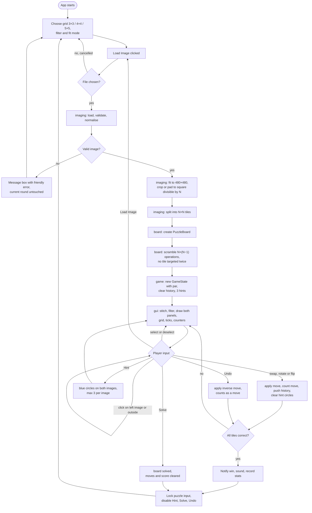
```mermaid
flowchart TD
    START(["App starts"]) --> IDLE["Choose grid 3×3 / 4×4 / 5×5,<br/>filter and fit mode"]
    IDLE --> LOADBTN["Load Image clicked"]
    LOADBTN --> DLG{"File chosen?"}
    DLG -- "no, cancelled" --> IDLE
    DLG -- yes --> VAL["imaging: load, validate, normalise"]
    VAL --> OK{"Valid image?"}
    OK -- no --> ERR["Message box with friendly error,<br/>current round untouched"]
    ERR --> IDLE
    OK -- yes --> PREP["imaging: fit to 480×480,<br/>crop or pad to square divisible by N"]
    PREP --> SPLIT["imaging: split into N×N tiles"]
    SPLIT --> NEWB["board: create PuzzleBoard"]
    NEWB --> SCRAM["board: scramble N×(N−1) operations,<br/>no tile targeted twice"]
    SCRAM --> NEWS["game: new GameState with par,<br/>clear history, 3 hints"]
    NEWS --> RENDER["gui: stitch, filter, draw both panels,<br/>grid, ticks, counters"]
    RENDER --> WAIT{"Player input"}
    WAIT -- "select or deselect" --> RENDER
    WAIT -- "click on left image or outside" --> WAIT
    WAIT -- "swap, rotate or flip" --> MOVE["apply move, count move, push history,<br/>clear hint circles"]
    WAIT -- Undo --> UNDO["apply inverse move,<br/>counts as a move"]
    WAIT -- Hint --> HINTF["blue circles on both images,<br/>max 3 per image"]
    WAIT -- Solve --> SOLVE["board solved,<br/>moves and score cleared"]
    WAIT -- "Load Image" --> LOADBTN
    HINTF --> RENDER
    MOVE --> CHECK{"All tiles correct?"}
    UNDO --> CHECK
    CHECK -- no --> RENDER
    CHECK -- yes --> WIN["Notify win, sound, record stats"]
    WIN --> LOCK["Lock puzzle input,<br/>disable Hint, Solve, Undo"]
    SOLVE --> LOCK
    LOCK --> IDLE
```

### 3.5.3 Load sequence

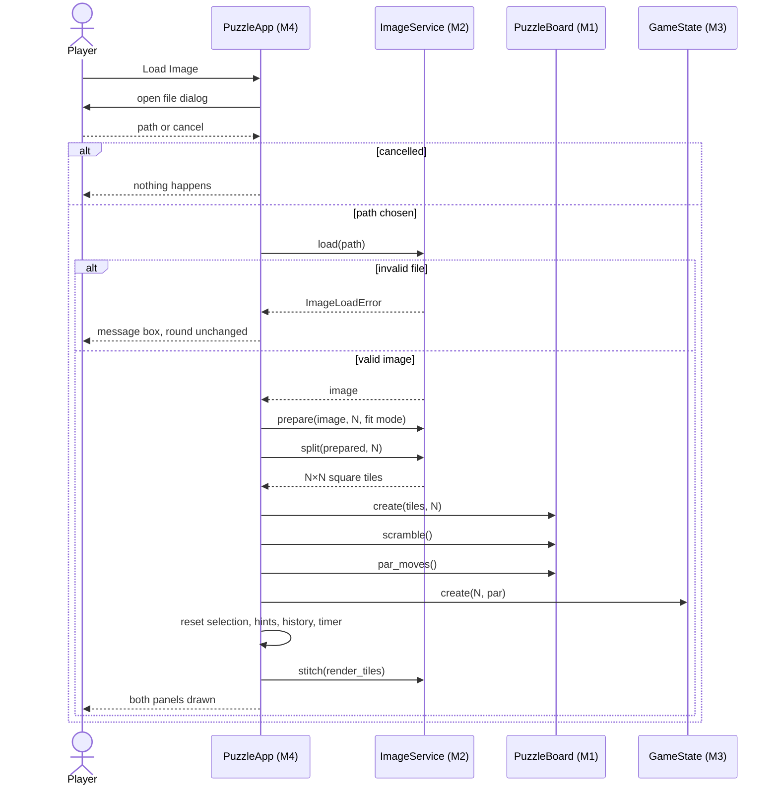
```mermaid
sequenceDiagram
    actor P as Player
    participant APP as PuzzleApp (M4)
    participant IMG as ImageService (M2)
    participant PB as PuzzleBoard (M1)
    participant GS as GameState (M3)
    P->>APP: Load Image
    APP->>P: open file dialog
    P-->>APP: path or cancel
    alt cancelled
        APP-->>P: nothing happens
    else path chosen
        APP->>IMG: load(path)
        alt invalid file
            IMG-->>APP: ImageLoadError
            APP-->>P: message box, round unchanged
        else valid image
            IMG-->>APP: image
            APP->>IMG: prepare(image, N, fit mode)
            APP->>IMG: split(prepared, N)
            IMG-->>APP: N×N square tiles
            APP->>PB: create(tiles, N)
            APP->>PB: scramble()
            APP->>PB: par_moves()
            APP->>GS: create(N, par)
            APP->>APP: reset selection, hints, history, timer
            APP->>IMG: stitch(render_tiles)
            APP-->>P: both panels drawn
        end
    end
```

### 3.5.4 Player move sequence (example: right click)

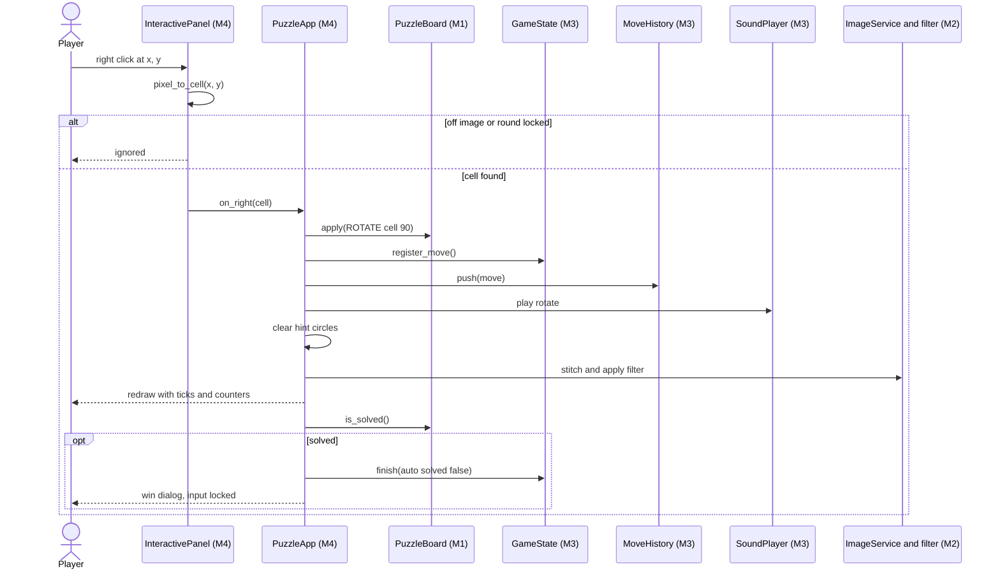
```mermaid
sequenceDiagram
    actor P as Player
    participant IP as InteractivePanel (M4)
    participant APP as PuzzleApp (M4)
    participant PB as PuzzleBoard (M1)
    participant GS as GameState (M3)
    participant MH as MoveHistory (M3)
    participant SP as SoundPlayer (M3)
    participant IMG as ImageService and filter (M2)
    P->>IP: right click at x, y
    IP->>IP: pixel_to_cell(x, y)
    alt off image or round locked
        IP-->>P: ignored
    else cell found
        IP->>APP: on_right(cell)
        APP->>PB: apply(ROTATE cell 90)
        APP->>GS: register_move()
        APP->>MH: push(move)
        APP->>SP: play rotate
        APP->>APP: clear hint circles
        APP->>IMG: stitch and apply filter
        APP-->>P: redraw with ticks and counters
        APP->>PB: is_solved()
        opt solved
            APP->>GS: finish(auto solved false)
            APP-->>P: win dialog, input locked
        end
    end
```

### 3.5.5 Round lifecycle

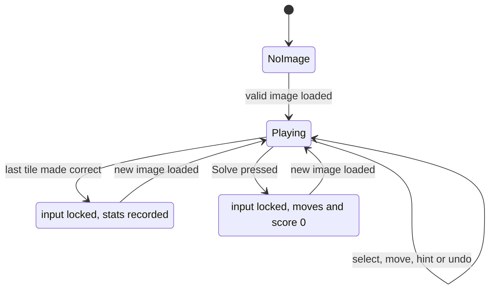
```mermaid
stateDiagram-v2
    [*] --> NoImage
    NoImage --> Playing : valid image loaded
    Playing --> Playing : select, move, hint or undo
    Playing --> Won : last tile made correct
    Playing --> AutoSolved : Solve pressed
    Won --> Playing : new image loaded
    AutoSolved --> Playing : new image loaded
    Won : input locked, stats recorded
    AutoSolved : input locked, moves and score 0
```

Loading a new image while Playing also starts a fresh Playing round with every counter reset.

---

# 4. Member 1 — Tiles, Transformations and Puzzle Board

## 4.1 Mission

Own the heart of the puzzle: what a tile is, how it moves and turns, how the board is scrambled fairly, how correctness is decided, and how Solve restores everything.

## 4.2 Files owned and diagrams

```
board/orientation.py     Orientation algebra (rotation + mirror composition)
board/tile.py            Tile class
board/transformations.py Transformation base class + Swap, Rotate, Flip
board/scrambler.py       Random scramble generator (no tile targeted twice)
board/puzzle_board.py    PuzzleBoard (implements contract)
board/par_solver.py      Creative: minimum-moves calculator
tests/board/...
```

### Component diagram — Member 1

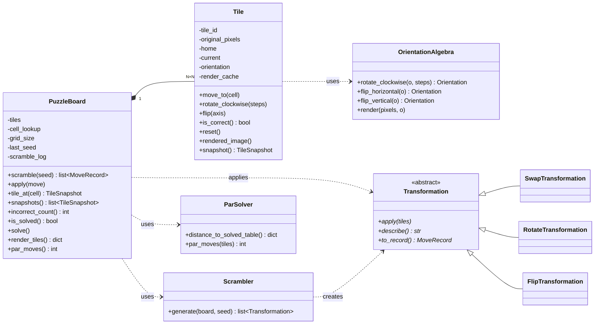
```mermaid
classDiagram
    direction LR
    class PuzzleBoard {
        -tiles
        -cell_lookup
        -grid_size
        -last_seed
        -scramble_log
        +scramble(seed) list~MoveRecord~
        +apply(move)
        +tile_at(cell) TileSnapshot
        +snapshots() list~TileSnapshot~
        +incorrect_count() int
        +is_solved() bool
        +solve()
        +render_tiles() dict
        +par_moves() int
    }
    class Tile {
        -tile_id
        -original_pixels
        -home
        -current
        -orientation
        -render_cache
        +move_to(cell)
        +rotate_clockwise(steps)
        +flip(axis)
        +is_correct() bool
        +reset()
        +rendered_image()
        +snapshot() TileSnapshot
    }
    class OrientationAlgebra {
        +rotate_clockwise(o, steps) Orientation
        +flip_horizontal(o) Orientation
        +flip_vertical(o) Orientation
        +render(pixels, o)
    }
    class Transformation {
        <<abstract>>
        +apply(tiles)*
        +describe()* str
        +to_record()* MoveRecord
    }
    class SwapTransformation
    class RotateTransformation
    class FlipTransformation
    class Scrambler {
        +generate(board, seed) list~Transformation~
    }
    class ParSolver {
        +distance_to_solved_table() dict
        +par_moves(tiles) int
    }
    Transformation <|-- SwapTransformation
    Transformation <|-- RotateTransformation
    Transformation <|-- FlipTransformation
    PuzzleBoard "1" *-- "N×N" Tile
    Tile ..> OrientationAlgebra : uses
    PuzzleBoard ..> Scrambler : uses
    PuzzleBoard ..> ParSolver : uses
    PuzzleBoard ..> Transformation : applies
    Scrambler ..> Transformation : creates
```

### Flow diagrams — Member 1

Scramble generation:

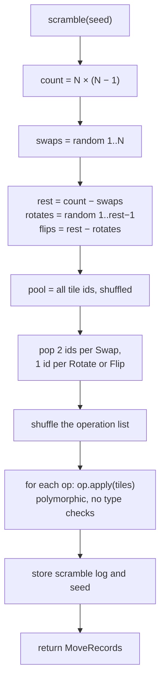
```mermaid
flowchart TD
    A["scramble(seed)"] --> B["count = N × (N − 1)"]
    B --> C["swaps = random 1..N"]
    C --> D["rest = count − swaps<br/>rotates = random 1..rest−1<br/>flips = rest − rotates"]
    D --> E["pool = all tile ids, shuffled"]
    E --> F["pop 2 ids per Swap,<br/>1 id per Rotate or Flip"]
    F --> G["shuffle the operation list"]
    G --> H["for each op: op.apply(tiles)<br/>polymorphic, no type checks"]
    H --> I["store scramble log and seed"]
    I --> J["return MoveRecords"]
```

Applying a move:

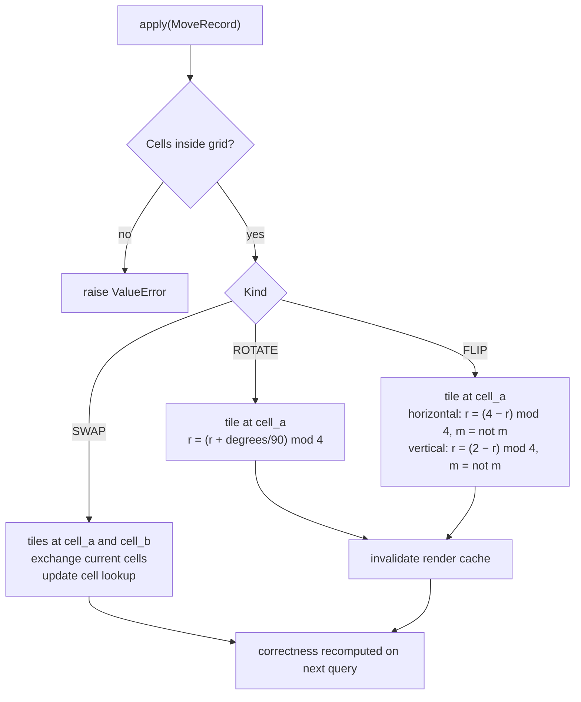
```mermaid
flowchart TD
    M["apply(MoveRecord)"] --> V{"Cells inside grid?"}
    V -- no --> X["raise ValueError"]
    V -- yes --> K{"Kind"}
    K -- SWAP --> S["tiles at cell_a and cell_b<br/>exchange current cells<br/>update cell lookup"]
    K -- ROTATE --> R["tile at cell_a<br/>r = (r + degrees/90) mod 4"]
    K -- FLIP --> F["tile at cell_a<br/>horizontal: r = (4 − r) mod 4, m = not m<br/>vertical: r = (2 − r) mod 4, m = not m"]
    R --> C["invalidate render cache"]
    F --> C
    S --> Q["correctness recomputed on next query"]
    C --> Q
```

Par calculation:

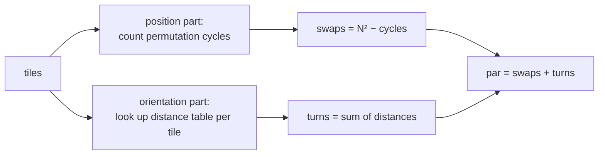
```mermaid
flowchart LR
    A["tiles"] --> B["position part:<br/>count permutation cycles"]
    A --> C["orientation part:<br/>look up distance table per tile"]
    B --> D["swaps = N² − cycles"]
    C --> E["turns = sum of distances"]
    D --> F["par = swaps + turns"]
    E --> F
```

## 4.3 Rubric rows secured

Transformations (3+ types, random every load, count scales, no tile targeted twice), correctness for green ticks and completion, reassembly order, Solve. OOP: inheritance + polymorphism via the Transformation hierarchy; encapsulation via Tile.

## 4.4 Required features — detailed specification

### R1. Tile

- Holds: `tile_id`, original pixel data (never modified), home cell, current cell, orientation.
- All fields private; read through properties.
- Methods: `move_to(cell)`, `rotate_clockwise(steps)`, `flip(axis)`, `is_correct()`, `reset()`, `rendered_image()`, `snapshot()`.
- `rendered_image()` produces the pixels as currently oriented (see A1). Cache the result and invalidate the cache when orientation changes, so re-rendering a 5×5 board is cheap.
- Constructor validates: tile_id ≥ 0, home cell non-negative, image non-empty.

### R2. Transformation hierarchy (inheritance + polymorphism)

- Abstract base `Transformation` with abstract methods `apply(board_tiles)`, `describe()`, `to_record()`.
- Subclasses: `SwapTransformation(tile_a, tile_b)`, `RotateTransformation(tile, degrees)`, `FlipTransformation(tile, axis)`.
- Constructors validate: swap of a tile with itself is rejected; degrees must be 90/180/270; axis must be horizontal/vertical.
- The scrambler produces a mixed list of these objects and applies them in one loop **without checking their type**. Write this loop deliberately and mention it in its docstring; it is the textbook polymorphism example the marker looks for.

### R3. Scrambler

- Count = N × (N − 1) → 6, 12, 20.
- Contains all three types every time.
- No tile targeted twice (algorithm A2).
- Optional seed for reproducibility (creative C1). Without a seed, results differ every load.
- Returns the list of applied transformations (used for the scramble log, C3).

### R4. PuzzleBoard

- Constructor takes the N×N tile images in row-major order and N; creates tiles with home = current = their row-major cell.
- Rejects N not in {3, 4, 5} and a tile list whose length is not N×N.
- `apply(move)` translates a `MoveRecord` (which uses **cells**, because the player clicks cells) into the tile currently at that cell, then applies the matching Transformation.
- `tile_at(cell)` must be O(1): maintain a private cell → tile lookup and keep it in sync on every swap.
- `render_tiles()` returns cell → rendered image for all cells.
- `solve()` resets every tile to home and default orientation; resets the lookup.

## 4.5 Algorithms

### A1. Orientation algebra (why ticks are always right)

Orientation is the pair (r, m): take the original tile, mirror it horizontally if m is true, then rotate clockwise r times. Correct orientation is exactly (0, false).

Composition rules (derived from the fact that mirroring reverses the direction of rotation):

```
FUNCTION rotate_clockwise(orientation, steps)
    RETURN (orientation.r + steps) MOD 4, orientation.m

FUNCTION flip_horizontal(orientation)
    RETURN (4 - orientation.r) MOD 4, NOT orientation.m

FUNCTION flip_vertical(orientation)
    RETURN (2 - orientation.r + 4) MOD 4, NOT orientation.m

FUNCTION render(original_pixels, orientation)
    img <- original_pixels
    IF orientation.m THEN img <- mirror img left-right
    REPEAT orientation.r TIMES: img <- rotate img 90° clockwise
    RETURN img
```

Sanity check to put in tests: start (0, false) → flip horizontal → (0, true) → flip vertical → (2, false), which is the same as rotating 180°. The tile is correctly reported as **not** correct, and pressing rotate twice fixes it.

### A2. Scramble generation — no tile targeted twice

A swap uses 2 tiles; a rotate or flip uses 1. With `s` swaps in a batch of `count` operations, tiles used = count + s, which must be ≤ N². Since count = N(N−1), that gives s ≤ N.

```
FUNCTION generate_scramble(board, seed optional)
    rng <- new random generator (seeded if seed given)
    N <- board.grid_size
    count <- N * (N - 1)
    swaps <- rng.integer_between(1, N)            // ≥1 guarantees the board is never pre-solved
    rest <- count - swaps
    rotates <- rng.integer_between(1, rest - 1)   // ≥1 rotate
    flips <- rest - rotates                        // ≥1 flip
    pool <- all tile ids, shuffled by rng
    ops <- empty list
    REPEAT swaps TIMES:  ops.add(Swap(pool.pop(), pool.pop()))
    REPEAT rotates TIMES: ops.add(Rotate(pool.pop(), rng.choice(90, 180, 270)))
    REPEAT flips TIMES:  ops.add(Flip(pool.pop(), rng.choice(HORIZONTAL, VERTICAL)))
    shuffle ops with rng
    FOR EACH op IN ops: op.apply(board tiles)      // polymorphic, no type checks
    RETURN ops
```

Why the board can never load already solved: each swap moves two tiles away from their different home cells, and a tile touched by a swap is never touched again.

### A3. Applying a player move

```
FUNCTION apply(move)
    VALIDATE cells are inside the grid, ELSE RAISE ValueError
    IF move.kind = SWAP:
        a <- tile_at(move.cell_a); b <- tile_at(move.cell_b)
        exchange a.current and b.current; update cell lookup
    ELSE IF move.kind = ROTATE:
        tile_at(move.cell_a).rotate_clockwise(move.degrees / 90)
    ELSE IF move.kind = FLIP:
        tile_at(move.cell_a).flip(move.axis)
```

(Using the Transformation subclasses inside this function is recommended, so player moves reuse the same polymorphic objects as the scrambler.)

## 4.6 Creative features

**C1. Seeded scrambles ("Puzzle code").** `scramble(seed)` produces an identical puzzle for the same image, grid and seed, so friends can race on the same puzzle. Without a seed, a fresh random seed is drawn and exposed via a read-only property so the GUI can display it.

**C2. Par — the optimal number of moves.** Because rotate and flip act on whatever tile sits in a cell, fixing positions and fixing orientations are independent, so the exact minimum is computable:

```
FUNCTION distance_to_solved_table()
    // Breadth-first search BACKWARDS from the solved state over the 8 orientations.
    // Going backwards means using the inverse of each player action:
    //   inverse of "rotate 90° CW" = rotate 90° counter-clockwise: (r - 1) MOD 4
    //   inverse of "flip horizontal" = flip horizontal (it undoes itself)
    start <- (0, false); dist[start] <- 0; queue <- [start]
    WHILE queue not empty:
        s <- queue.pop_front()
        FOR EACH prev IN [ ((s.r - 1) MOD 4, s.m), flip_horizontal(s) ]:
            IF prev not in dist: dist[prev] <- dist[s] + 1; queue.push(prev)
    RETURN dist        // dist[state] = fewest player actions to reach (0, false)

FUNCTION par_moves(board)
    visited <- empty set; cycles <- 0
    FOR EACH tile t:                                 // permutation cycles of positions
        IF t not visited:
            cycles <- cycles + 1
            follow t -> tile whose home is t.current -> ... marking visited
    swaps_needed <- N*N - cycles
    turns_needed <- SUM over tiles of distance_to_solved_table()[t.orientation]
    RETURN swaps_needed + turns_needed
```

Expected distance-to-solved values (use as test oracle; player actions are only "rotate 90° CW" and "flip horizontal"):

| Orientation (r, m) | (0,F) | (1,F) | (2,F) | (3,F) | (0,T) | (1,T) | (2,T) | (3,T) |
|---|---|---|---|---|---|---|---|---|
| Moves to solve | 0 | 3 | 2 | 1 | 1 | 2 | 3 | 2 |

Par feeds Member 3's scoring and star rating (through integration; you only expose `par_moves()`).

**C3. Scramble log.** Each transformation's `describe()` returns text such as "Rotate tile 7 by 180°". Store the last scramble's descriptions; the GUI can show them in an optional "How was it scrambled?" panel after completion.

## 4.7 Edge cases to handle

- Swap where both cells are the same → reject (the GUI deselects instead).
- Rotation of 360° or 0° → reject.
- Non-square tiles (image not square): rotating 90° swaps width and height. Therefore the prepared image **must be divided into square tiles** or rendering breaks. Agreed rule: Member 2 guarantees square tiles (tile width = tile height). Validate this in the PuzzleBoard constructor and raise a clear error otherwise.
- `solve()` on an already solved board → no error, no change.

## 4.8 Testing plan

Use synthetic tiles: small arrays where each tile has a unique solid colour or its number drawn in, so tests can check exactly which pixels ended up where. No image files or Member 2 code needed.

| Test | Expectation |
|---|---|
| Orientation composition table | All 8 states × 2 actions match A1. |
| Flip H then flip V | Equals (2, false); not correct; two rotates fix it. |
| Four rotations | Returns to (0, false) and identical pixels. |
| Render correctness | Rendered pixels equal OpenCV/numpy reference rotations/flips for all 8 states. |
| Scramble count | 6 / 12 / 20 for N = 3 / 4 / 5. |
| No tile targeted twice | Across 200 random scrambles per N, collected tile ids are all unique. |
| All three types present | Every scramble contains Swap, Rotate and Flip. |
| Never pre-solved | 200 scrambles per N: `is_solved()` is false every time. |
| Seed reproducibility | Same seed → identical move list and identical board. |
| apply() swap / rotate / flip | Positions, lookup table and correctness update correctly. |
| Solve | After scramble + solve: solved, incorrect_count = 0. |
| Par | Solved board → 0; single swap → 1; single tile at (1,F) → 3; hand-built case with a 3-cycle → 2 swaps. |
| Invalid inputs | Wrong N, wrong tile count, non-square tile, bad degrees/axis → ValueError. |

## 4.9 Deliverables checklist

- [ ] Orientation algebra + tests
- [ ] Tile class (encapsulated, cached rendering)
- [ ] Transformation base + 3 subclasses
- [ ] Scrambler (A2) + guarantee tests
- [ ] PuzzleBoard implementing the full contract
- [ ] C1 seeded scrambles
- [ ] C2 par solver + oracle tests
- [ ] C3 scramble log
- [ ] Docstrings everywhere, PR reviewed

---

# 5. Member 2 — Image Processing and Visual Filters

## 5.1 Mission

Own everything that turns a file on disk into equally sized square tiles and back into one displayable image, plus OpenCV visual filters. Own the file-related half of error handling (the GUI only displays your messages).

## 5.2 Files owned and diagrams

```
imaging/image_loader.py   Load + validate files (raises ImageLoadError)
imaging/fit_strategy.py   FitStrategy base + CropFit + PadFit
imaging/image_service.py  prepare / split / stitch (implements contract)
imaging/filters.py        ImageFilter base + filters + registry
imaging/enhance.py        Creative: auto-enhance
imaging/samples.py        Creative: procedurally generated sample images
tests/imaging/...
```

### Component diagram — Member 2

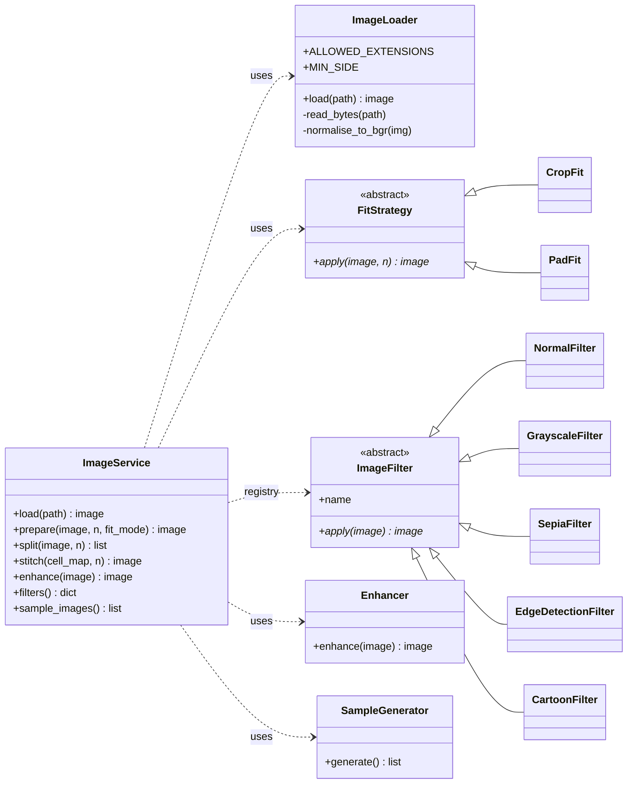
```mermaid
classDiagram
    direction LR
    class ImageService {
        +load(path) image
        +prepare(image, n, fit_mode) image
        +split(image, n) list
        +stitch(cell_map, n) image
        +enhance(image) image
        +filters() dict
        +sample_images() list
    }
    class ImageLoader {
        +ALLOWED_EXTENSIONS
        +MIN_SIDE
        +load(path) image
        -read_bytes(path)
        -normalise_to_bgr(img)
    }
    class FitStrategy {
        <<abstract>>
        +apply(image, n)* image
    }
    class CropFit
    class PadFit
    class ImageFilter {
        <<abstract>>
        +name
        +apply(image)* image
    }
    class NormalFilter
    class GrayscaleFilter
    class SepiaFilter
    class EdgeDetectionFilter
    class CartoonFilter
    class Enhancer {
        +enhance(image) image
    }
    class SampleGenerator {
        +generate() list
    }
    ImageService ..> ImageLoader : uses
    ImageService ..> FitStrategy : uses
    ImageService ..> ImageFilter : registry
    ImageService ..> Enhancer : uses
    ImageService ..> SampleGenerator : uses
    FitStrategy <|-- CropFit
    FitStrategy <|-- PadFit
    ImageFilter <|-- NormalFilter
    ImageFilter <|-- GrayscaleFilter
    ImageFilter <|-- SepiaFilter
    ImageFilter <|-- EdgeDetectionFilter
    ImageFilter <|-- CartoonFilter
```

### Flow diagrams — Member 2

Load and prepare pipeline:

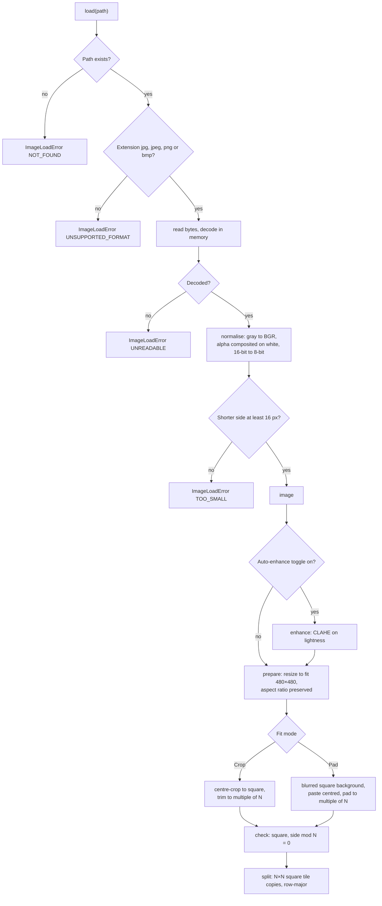
```mermaid
flowchart TD
    A["load(path)"] --> B{"Path exists?"}
    B -- no --> E1["ImageLoadError NOT_FOUND"]
    B -- yes --> C{"Extension jpg, jpeg, png or bmp?"}
    C -- no --> E2["ImageLoadError UNSUPPORTED_FORMAT"]
    C -- yes --> D["read bytes, decode in memory"]
    D --> F{"Decoded?"}
    F -- no --> E3["ImageLoadError UNREADABLE"]
    F -- yes --> G["normalise: gray to BGR,<br/>alpha composited on white, 16-bit to 8-bit"]
    G --> H{"Shorter side at least 16 px?"}
    H -- no --> E4["ImageLoadError TOO_SMALL"]
    H -- yes --> I["image"]
    I --> EN{"Auto-enhance toggle on?"}
    EN -- yes --> CL["enhance: CLAHE on lightness"]
    EN -- no --> J
    CL --> J["prepare: resize to fit 480×480,<br/>aspect ratio preserved"]
    J --> N{"Fit mode"}
    N -- Crop --> O["centre-crop to square,<br/>trim to multiple of N"]
    N -- Pad --> Q["blurred square background,<br/>paste centred, pad to multiple of N"]
    O --> R["check: square, side mod N = 0"]
    Q --> R
    R --> S["split: N×N square tile copies, row-major"]
```

Display pipeline:

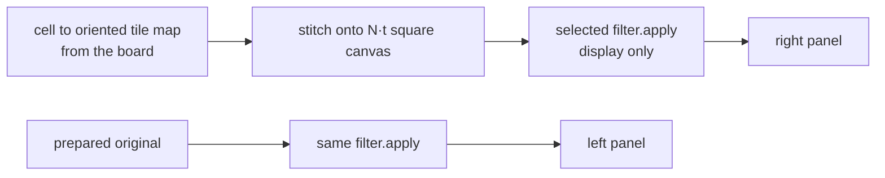
```mermaid
flowchart LR
    A["cell to oriented tile map<br/>from the board"] --> B["stitch onto N·t square canvas"]
    B --> C["selected filter.apply<br/>display only"]
    D["prepared original"] --> E["same filter.apply"]
    C --> F["right panel"]
    E --> G["left panel"]
```

## 5.3 Rubric rows secured

Image loading (JPG/PNG/BMP, resize with correct aspect, crop/pad to divide evenly), all three grid sizes tile correctly, reassembly into one image, non-image file handling. OOP: inheritance + polymorphism via `FitStrategy` and `ImageFilter`.

## 5.4 Required features — detailed specification

### R1. Loading and validation

- Accepted extensions (case-insensitive): `.jpg`, `.jpeg`, `.png`, `.bmp`.
- Validation order: path exists → extension allowed → file decodes as an image → image large enough.
- Read the file as bytes and decode in memory rather than passing the path directly to OpenCV. OpenCV's direct path reading fails silently on Windows paths containing non-English characters; decoding bytes avoids this.
- Normalise every image to 3-channel 8-bit colour:
  - Grayscale → convert to 3 channels.
  - PNG with transparency → composite onto a white background (otherwise transparent areas turn black).
- Minimum source size: 16 px on the shorter side, otherwise `ImageLoadError(TOO_SMALL)`.
- Every failure raises `ImageLoadError` with a friendly message, e.g. "notes.txt is not a supported image. Please choose a JPG, PNG or BMP file." Never let a raw OpenCV error escape.

```
FUNCTION load(path)
    IF path does not exist: RAISE ImageLoadError(NOT_FOUND, "...")
    IF lowercase extension not in ALLOWED: RAISE ImageLoadError(UNSUPPORTED_FORMAT, "...")
    bytes <- read file as bytes
    img <- decode bytes with OpenCV (keep alpha if present)
    IF img is empty: RAISE ImageLoadError(UNREADABLE, "... may be corrupted ...")
    img <- normalise_to_bgr(img)          // gray → BGR, BGRA → composite on white
    IF min(height, width) < 16: RAISE ImageLoadError(TOO_SMALL, "...")
    RETURN img
```

### R2. Fit to screen (aspect ratio preserved)

- Target box: 480 × 480 px (named constant).
- Scale factor = min(box_w / w, box_h / h), applied to both dimensions (so aspect ratio is preserved). Scale up small images too, so tiles are always a playable size.
- Interpolation: area-based when shrinking, cubic when enlarging.

### R3. Make the grid divide evenly into square tiles (polymorphism)

Square tiles are required so rotations don't change tile size (see Member 1, 4.7). Therefore the prepared image is always a square whose side is a multiple of N.

- Abstract `FitStrategy` with `apply(image, grid_size) -> square image`.
- `CropFit` (default): centre-crop the resized image to a square, then trim to the largest multiple of N.
- `PadFit` (creative option, C2): keep the whole picture and pad to a square with a blurred, darkened copy of the image as the border, then trim/pad to a multiple of N.

```
FUNCTION CropFit.apply(image, N)
    side <- min(height, width)
    side <- side - (side MOD N)                  // divisible by N
    top <- (height - side) / 2 rounded down; left <- (width - side) / 2 rounded down
    RETURN image[top : top+side, left : left+side]

FUNCTION prepare(image, N, fit_mode)
    VALIDATE N in {3,4,5}
    resized <- resize_to_fit_box(image, box 480×480)
    strategy <- FIT_STRATEGIES[fit_mode]          // polymorphic lookup
    result <- strategy.apply(resized, N)
    ASSERT result is square AND side MOD N = 0
    RETURN result
```

### R4. Split and stitch

```
FUNCTION split(image, N)
    t <- side / N
    tiles <- empty list
    FOR row IN 0..N-1: FOR col IN 0..N-1:
        tiles.add(copy of image[row*t : (row+1)*t, col*t : (col+1)*t])
    RETURN tiles                                   // row-major, independent copies

FUNCTION stitch(cell_to_image, N)
    t <- side of any tile
    VALIDATE exactly N*N entries, all t×t×3
    canvas <- black image of size (N*t) × (N*t)
    FOR EACH (cell, img): paste img at (cell.row*t, cell.col*t)
    RETURN canvas
```

Copies matter: tiles must not share memory with the source image, otherwise modifying one tile corrupts another.

## 5.5 Creative features

**C1. Visual filter modes (inheritance + polymorphism).** Abstract `ImageFilter` with `name` and `apply(image) -> new image` (never modifies the input). Subclasses:

| Filter | Approach |
|---|---|
| Normal | Returns the image unchanged. |
| Grayscale | Convert to gray, back to 3 channels. |
| Sepia | Multiply each pixel by the standard sepia colour matrix, clip to 0–255. |
| Edge Detection ("hard mode") | Gray → light blur → Canny edges → 3 channels. |
| Cartoon | Bilateral filter for flat colours + adaptive-threshold edges combined as a mask. |

Provide an ordered registry `filters()` so the GUI can fill a dropdown by iterating names. Filters are display-only; correctness is decided on tile state, never on filtered pixels. The same filter is applied to both panels so the reference stays comparable.

**C2. Pad mode with blurred border.** Instead of cutting off parts of a wide photo, show all of it inside a square with a blurred background fill (as used by social-media apps).

```
FUNCTION PadFit.apply(image, N)
    side <- max(height, width); side <- side + ((N - side MOD N) MOD N)
    background <- resize image to side×side, heavy Gaussian blur, darken 40%
    paste original centred on background
    RETURN background
```

**C3. Auto-enhance (optional toggle).** Improve dull photos before tiling using CLAHE (contrast-limited adaptive histogram equalisation) on the lightness channel only, so colours don't shift.

```
FUNCTION enhance(image)
    lab <- convert image to LAB colour space
    L <- apply CLAHE (clip limit 2.0, tile grid 8×8) to lightness channel
    RETURN convert (L, a, b) back to BGR
```

**C4. Built-in sample images.** `sample_images()` generates 2–3 colourful images procedurally (gradient background, numbered shapes, text) so the game can be demonstrated without hunting for files. Generated in memory; no copyrighted assets.

## 5.6 Edge cases to handle

- Uppercase extensions (`PHOTO.JPG`) accepted.
- A `.png` file that is really text, or a zero-byte file → UNREADABLE with a friendly message.
- A renamed file (JPEG data with `.bmp` extension) → accept if it decodes (content matters, not the name).
- Very large images (e.g. 8000 px) → loads and shrinks without freezing noticeably.
- Extreme aspect ratios (e.g. 2000×100) → crop still produces a valid square; pad mode shows the whole strip.
- 16-bit PNGs → normalised to 8-bit.

## 5.7 Testing plan

Generate all test images inside the tests (numpy arrays written to a temporary folder). No dependency on other members.

| Test | Expectation |
|---|---|
| Load JPG, PNG, BMP | All three return 3-channel 8-bit images. |
| Uppercase extension | Loads. |
| `.txt` file | ImageLoadError(UNSUPPORTED_FORMAT). |
| Corrupt `.png` / empty file | ImageLoadError(UNREADABLE). |
| Missing path | ImageLoadError(NOT_FOUND). |
| 10×10 image | ImageLoadError(TOO_SMALL). |
| Transparent PNG | Transparent areas become white, not black. |
| Grayscale input | Output has 3 channels. |
| Non-ASCII filename | Loads correctly. |
| Fit preserves aspect | 1000×500 → longest side 480, ratio 2:1 within 1%. |
| Prepare, N = 3/4/5 × awkward sizes (e.g. 997×613) | Output square, side divisible by N, for both Crop and Pad. |
| Split count and size | N² tiles, all identical square size. |
| Split → stitch round trip | Pixel-identical to the prepared image. |
| Split returns copies | Changing one tile doesn't change the source. |
| Every filter | Same shape and dtype; input unchanged; grayscale has equal channels; edge output only 0/255. |
| Enhance | Same shape; hue broadly preserved. |

## 5.8 Deliverables checklist

- [ ] Loader with full validation and friendly errors
- [ ] Fit-to-box resize (aspect preserved)
- [ ] FitStrategy base + CropFit + PadFit
- [ ] prepare / split / stitch implementing the contract
- [ ] ImageFilter base + 5 filters + ordered registry
- [ ] C3 auto-enhance
- [ ] C4 sample images
- [ ] Tests, docstrings, PR reviewed

---

# 6. Member 3 — Game State, Scoring, Hints, Undo, Sound and Statistics

## 6.1 Mission

Own the rules of a round: counting moves, enforcing the hint budget, deciding which tile to hint, locking the round on completion, resetting on Solve, plus the creative "game feel" features: timer, score, stars, undo, sound effects, best scores and achievements.

## 6.2 Files owned and diagrams

```
game/game_state.py    GameState (implements contract)
game/scoring.py       Score and star-rating rules
game/hints.py         HintStrategy base + RandomHint + SmartHint, HintAdvisor
game/history.py       MoveHistory (undo) + inverse moves
game/sound.py         SoundBackend base + TonePlayer + SilentPlayer, SoundPlayer
game/stats_store.py   Persistent best scores + achievements
tests/game/...
```

### Component diagram — Member 3

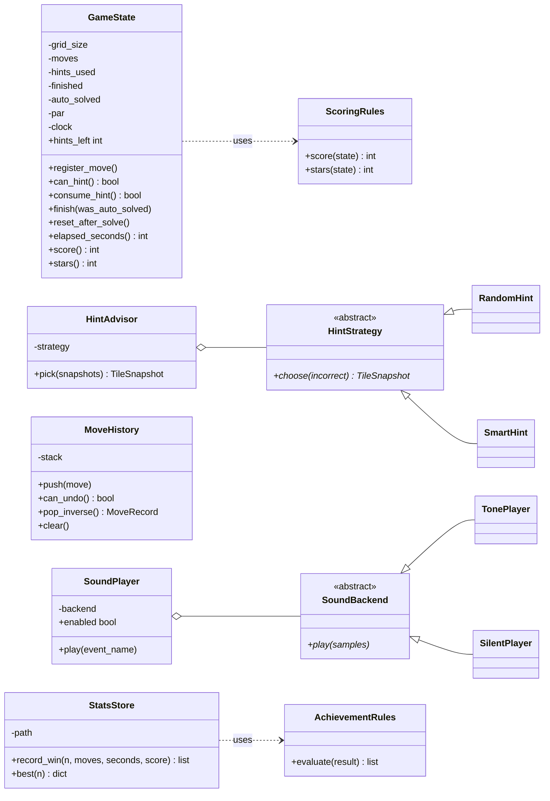
```mermaid
classDiagram
    direction LR
    class GameState {
        -grid_size
        -moves
        -hints_used
        -finished
        -auto_solved
        -par
        -clock
        +register_move()
        +can_hint() bool
        +consume_hint() bool
        +hints_left int
        +finish(was_auto_solved)
        +reset_after_solve()
        +elapsed_seconds() int
        +score() int
        +stars() int
    }
    class ScoringRules {
        +score(state) int
        +stars(state) int
    }
    class HintAdvisor {
        -strategy
        +pick(snapshots) TileSnapshot
    }
    class HintStrategy {
        <<abstract>>
        +choose(incorrect)* TileSnapshot
    }
    class RandomHint
    class SmartHint
    class MoveHistory {
        -stack
        +push(move)
        +can_undo() bool
        +pop_inverse() MoveRecord
        +clear()
    }
    class SoundPlayer {
        -backend
        +enabled bool
        +play(event_name)
    }
    class SoundBackend {
        <<abstract>>
        +play(samples)*
    }
    class TonePlayer
    class SilentPlayer
    class StatsStore {
        -path
        +record_win(n, moves, seconds, score) list
        +best(n) dict
    }
    class AchievementRules {
        +evaluate(result) list
    }
    GameState ..> ScoringRules : uses
    HintAdvisor o-- HintStrategy
    HintStrategy <|-- RandomHint
    HintStrategy <|-- SmartHint
    SoundPlayer o-- SoundBackend
    SoundBackend <|-- TonePlayer
    SoundBackend <|-- SilentPlayer
    StatsStore ..> AchievementRules : uses
```

### Flow diagrams — Member 3

GameState lifecycle:

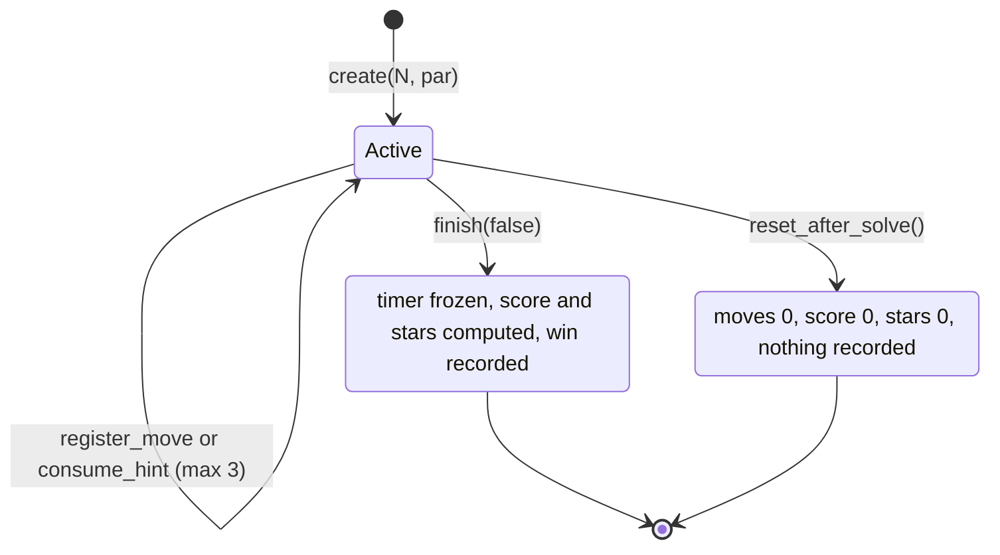
```mermaid
stateDiagram-v2
    [*] --> Active : create(N, par)
    Active --> Active : register_move or consume_hint (max 3)
    Active --> FinishedWon : finish(false)
    Active --> FinishedAuto : reset_after_solve()
    FinishedWon --> [*]
    FinishedAuto --> [*]
    FinishedWon : timer frozen, score and stars computed, win recorded
    FinishedAuto : moves 0, score 0, stars 0, nothing recorded
```

Hint selection:

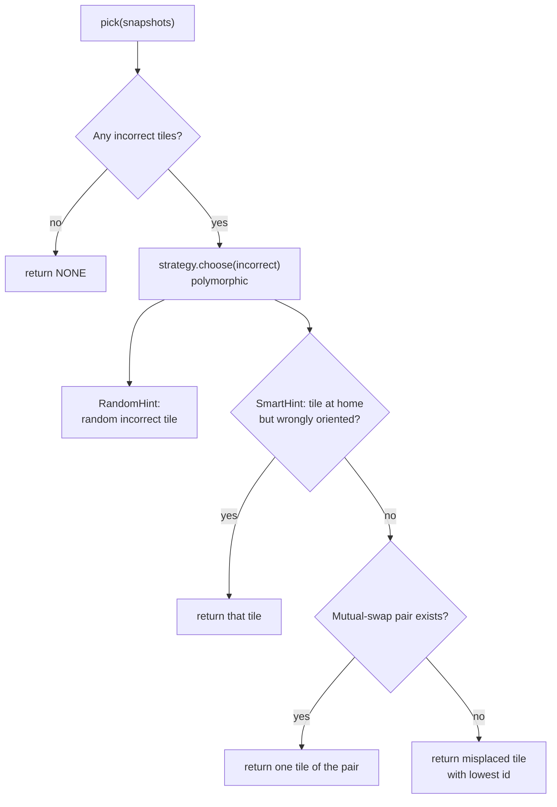
```mermaid
flowchart TD
    A["pick(snapshots)"] --> B{"Any incorrect tiles?"}
    B -- no --> Z["return NONE"]
    B -- yes --> C["strategy.choose(incorrect)<br/>polymorphic"]
    C --> R["RandomHint:<br/>random incorrect tile"]
    C --> S1{"SmartHint: tile at home<br/>but wrongly oriented?"}
    S1 -- yes --> O1["return that tile"]
    S1 -- no --> S2{"Mutual-swap pair exists?"}
    S2 -- yes --> O2["return one tile of the pair"]
    S2 -- no --> O3["return misplaced tile<br/>with lowest id"]
```

Undo:

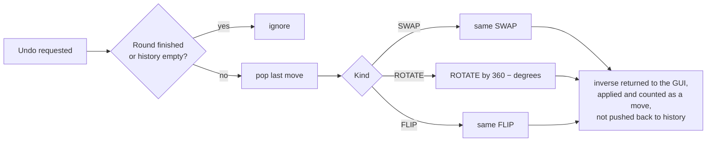
```mermaid
flowchart LR
    A["Undo requested"] --> B{"Round finished<br/>or history empty?"}
    B -- yes --> X["ignore"]
    B -- no --> C["pop last move"]
    C --> D{"Kind"}
    D -- SWAP --> E["same SWAP"]
    D -- ROTATE --> F["ROTATE by 360 − degrees"]
    D -- FLIP --> G["same FLIP"]
    E --> H["inverse returned to the GUI,<br/>applied and counted as a move,<br/>not pushed back to history"]
    F --> H
    G --> H
```

Win recording:

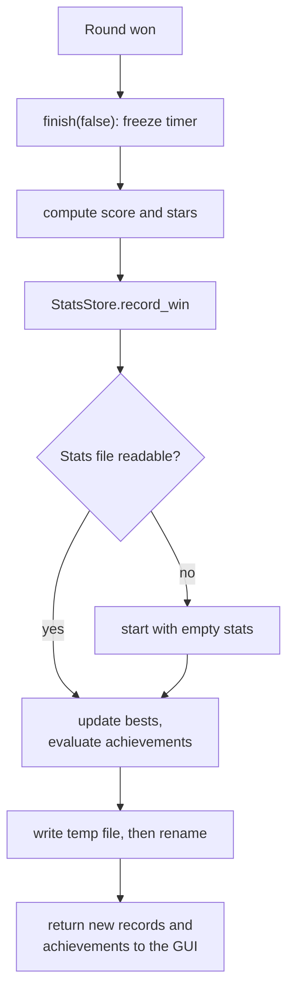
```mermaid
flowchart TD
    W["Round won"] --> F["finish(false): freeze timer"]
    F --> SC["compute score and stars"]
    SC --> RW["StatsStore.record_win"]
    RW --> LD{"Stats file readable?"}
    LD -- no --> EMPTY["start with empty stats"]
    LD -- yes --> UPD["update bests,<br/>evaluate achievements"]
    EMPTY --> UPD
    UPD --> WR["write temp file, then rename"]
    WR --> OUT["return new records and<br/>achievements to the GUI"]
```

## 6.3 Rubric rows secured

Counters correct after every action, hint limit enforced, completion lock, Solve clears moves and score, new image fully resets state. OOP: encapsulated state with validated mutators; inheritance + polymorphism via `HintStrategy` and `SoundBackend`.

## 6.4 Required features — detailed specification

### R1. GameState

State (all private): grid size, moves, hints used, finished flag, auto-solved flag, start time, finish time, par.

```
CREATE(grid_size, par)
    VALIDATE grid_size in {3,4,5}, par >= 0
    moves <- 0; hints_used <- 0; finished <- false; auto_solved <- false
    start_time <- now (monotonic clock); finish_time <- NONE

FUNCTION register_move()
    IF finished: RETURN            // input locked, ignore silently
    moves <- moves + 1

FUNCTION can_hint() RETURN (NOT finished) AND hints_used < 3
FUNCTION consume_hint()
    IF NOT can_hint(): RETURN false
    hints_used <- hints_used + 1; RETURN true
FUNCTION hints_left RETURN 3 - hints_used

FUNCTION finish(was_auto_solved)
    IF finished: RETURN
    finished <- true; auto_solved <- was_auto_solved; finish_time <- now

FUNCTION reset_after_solve()        // brief: Solve clears moves and score
    moves <- 0; hints_used stays (budget is per image, irrelevant once finished)
    finish(was_auto_solved = true)

FUNCTION elapsed_seconds()
    end <- finish_time IF finished ELSE now
    RETURN whole seconds between start_time and end
```

Use a monotonic clock so changing the system time can't break the timer. The number "3" is a named constant `MAX_HINTS`.

### R2. Hint selection (polymorphism)

- Abstract `HintStrategy` with `choose(incorrect_snapshots) -> snapshot`.
- `RandomHint`: any incorrect tile at random (spec-minimum behaviour).
- `SmartHint` (default, creative): prefer the most useful tile.
- `HintAdvisor(strategy).pick(snapshots)`: filters incorrect tiles; returns NONE if none; otherwise delegates to the strategy.

```
FUNCTION SmartHint.choose(incorrect)
    // Priority 1: a tile sitting in its home cell but wrongly oriented (one quick fix)
    // Priority 2: a tile whose home cell is occupied by a tile whose home is this tile's cell
    //             (a mutual swap fixes two tiles in one move)
    // Priority 3: any misplaced tile, lowest tile id for predictability
    ...
```

The GUI marks `snapshot.current` on the right image and `snapshot.home` on the left image. Hint circles are cleared by the GUI after the next move.

### R3. Solve behaviour

`reset_after_solve()` sets moves to 0, marks the round finished and auto-solved. `score()` returns 0 when auto-solved. Stats must not record auto-solved rounds.

## 6.5 Creative features

**C1. Live timer.** `elapsed_seconds()` (above); the GUI refreshes it once per second. Frozen on finish.

**C2. Score and stars.** Scoring rewards bigger grids and efficient play relative to par (the true optimum, provided by Member 1's board via integration).

```
FUNCTION score()
    IF auto_solved: RETURN 0
    base <- 100 * grid_size * grid_size                 // 900 / 1600 / 2500
    extra_moves <- max(0, moves - par)
    penalty <- 15 * extra_moves + 2 * elapsed_seconds() + 150 * hints_used
    RETURN max(0, base - penalty)

FUNCTION stars()
    IF auto_solved OR NOT finished: RETURN 0
    IF moves <= par AND hints_used = 0: RETURN 3
    IF moves <= 1.5 * par: RETURN 2
    RETURN 1
```

Keep all numbers as named constants at the top of `scoring.py` and document the rationale in the module docstring.

**C3. Undo (counts as a move).**

```
FUNCTION inverse_of(move)
    SWAP(a, b)      → SWAP(a, b)
    ROTATE(c, d)    → ROTATE(c, 360 - d)
    FLIP(c, axis)   → FLIP(c, axis)

MoveHistory
    push(move): add to stack; cap at 200 entries (drop oldest)
    can_undo(): stack not empty
    pop_inverse(): RETURN inverse_of(stack.pop())
    clear(): empty the stack        // called on new image and on Solve
```

Undo is disabled when the round is finished. The undo move itself is **not** pushed back onto the history (no redo loop).

**C4. Sound effects (polymorphism, Null Object pattern).**

- Abstract `SoundBackend` with `play(samples)`.
- `TonePlayer`: plays synthesised tones through an optional audio library, on a background thread so the GUI never freezes.
- `SilentPlayer`: does nothing. Chosen automatically when the audio library is missing or there is no audio device (common in Docker/CI).
- `SoundPlayer.play(event_name)` looks up a short note sequence and delegates to the backend. Events: `select`, `swap`, `rotate`, `flip`, `hint`, `error`, `victory`.

```
FUNCTION synthesise(notes)                 // notes = list of (frequency Hz, duration s)
    FOR EACH note: sine wave at frequency × linear fade-out envelope (prevents clicks)
    RETURN concatenated 16-bit mono samples at 44 100 Hz
```

No audio files are shipped, so there are no licensing issues.

**C5. Persistent best scores.** `StatsStore` saves a small JSON file in the user's home folder (e.g. `~/.ImageUnraveling/stats.json`).

```
FUNCTION record_win(grid_size, moves, seconds, score)
    data <- load()                          // missing or corrupt file → start empty, never crash
    entry <- data[grid_size] or defaults
    update best_score, fewest_moves, fastest_seconds, wins_count
    write to a temporary file, then rename over the real file   // no half-written file on crash
    RETURN list of "new record" flags (for a "New best!" message)
```

**C6. Achievements.** Evaluated when a round is won (not auto-solved): "Perfect" (moves = par), "No help" (0 hints), "Speedrun" (under 60 s on 4×4 or larger), "Grandmaster" (win a 5×5). Stored in the same stats file; return newly unlocked names so the GUI can announce them.

## 6.6 Edge cases to handle

- `register_move` after finish → ignored.
- More than 3 hint requests → `consume_hint` returns false every time after the third.
- Hint when no incorrect tiles → HintAdvisor returns NONE.
- `par` = 0 → star and score formulas must not divide by zero.
- Stats file unreadable, corrupt or not writable → game continues; failure logged, not shown as a crash.
- Undo with empty history → `can_undo` false; `pop_inverse` raises a clear error if called anyway.

## 6.7 Testing plan

Use fake `TileSnapshot` lists built by hand; no board, images or GUI needed. For the timer, inject a fake clock (constructor parameter defaulting to the real monotonic clock) so tests are instant and deterministic.

| Test | Expectation |
|---|---|
| Initial state | moves 0, hints_left 3, not finished. |
| register_move ×5 | moves 5. |
| Moves after finish | Unchanged. |
| Hint budget | 3 successes then false; hints_left 0. |
| Hints after finish | false. |
| reset_after_solve | moves 0, finished, auto-solved, score 0, stars 0. |
| Timer freeze | Fake clock advances after finish; elapsed unchanged. |
| Score monotonic | More moves / hints / time never increases score; never negative. |
| Bigger grid bigger base | 5×5 base > 4×4 > 3×3. |
| Stars | moves = par & 0 hints → 3; 1.4×par → 2; 3×par → 1. |
| RandomHint | Always returns an incorrect tile. |
| SmartHint priority | Rotated-in-place tile chosen over misplaced tiles; mutual-swap pair next. |
| Advisor on solved snapshots | NONE. |
| Inverse moves | Rotate 90 ↔ 270, 180 ↔ 180; swap and flip self-inverse. |
| History cap and clear | 250 pushes → 200 kept; clear empties. |
| SilentPlayer fallback | With the audio library unavailable, every play call is a no-op without errors. |
| StatsStore | Records update bests; corrupt file recovered; atomic write leaves a valid file. |
| Achievements | Each unlock condition triggers exactly once. |

## 6.8 Deliverables checklist

- [ ] GameState with all rules and injected clock
- [ ] HintStrategy base + RandomHint + SmartHint + HintAdvisor
- [ ] Solve reset behaviour
- [ ] C1 timer, C2 score + stars
- [ ] C3 undo history + inverse moves
- [ ] C4 sound (TonePlayer + SilentPlayer)
- [ ] C5 persistent best scores, C6 achievements
- [ ] Tests, docstrings, PR reviewed

---

# 7. Member 4 — GUI and Gameplay Interaction

## 7.1 Mission

Own everything the player sees and touches in Tkinter: layout, controls, precise click mapping, all overlays, dialogs and the interface-side half of error handling. Build it entirely against fakes of the Section 3.3 contracts.

## 7.2 Files owned and diagrams

```
gui/theme.py          Colours, fonts, sizes as named constants
gui/hit_test.py       Pure pixel → cell mapping (no Tkinter; unit-testable)
gui/panels.py         ImagePanel base + ReferencePanel + InteractivePanel
gui/controls.py       Toolbar + status bar widgets
gui/app.py            Main window / controller
gui/fakes.py          Fake board, fake state, fake image service for independent development
tests/gui/...
```

### Component diagram — Member 4

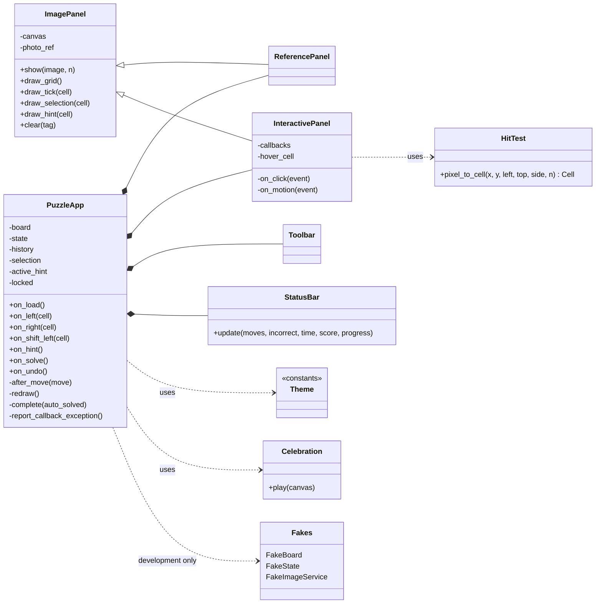
```mermaid
classDiagram
    direction LR
    class PuzzleApp {
        -board
        -state
        -history
        -selection
        -active_hint
        -locked
        +on_load()
        +on_left(cell)
        +on_right(cell)
        +on_shift_left(cell)
        +on_hint()
        +on_solve()
        +on_undo()
        -after_move(move)
        -redraw()
        -complete(auto_solved)
        -report_callback_exception()
    }
    class ImagePanel {
        -canvas
        -photo_ref
        +show(image, n)
        +draw_grid()
        +draw_tick(cell)
        +draw_selection(cell)
        +draw_hint(cell)
        +clear(tag)
    }
    class ReferencePanel
    class InteractivePanel {
        -callbacks
        -hover_cell
        -on_click(event)
        -on_motion(event)
    }
    class HitTest {
        +pixel_to_cell(x, y, left, top, side, n) Cell
    }
    class Toolbar
    class StatusBar {
        +update(moves, incorrect, time, score, progress)
    }
    class Theme {
        <<constants>>
    }
    class Celebration {
        +play(canvas)
    }
    class Fakes {
        FakeBoard
        FakeState
        FakeImageService
    }
    ImagePanel <|-- ReferencePanel
    ImagePanel <|-- InteractivePanel
    PuzzleApp *-- ReferencePanel
    PuzzleApp *-- InteractivePanel
    PuzzleApp *-- Toolbar
    PuzzleApp *-- StatusBar
    InteractivePanel ..> HitTest : uses
    PuzzleApp ..> Celebration : uses
    PuzzleApp ..> Theme : uses
    PuzzleApp ..> Fakes : development only
```

### Flow diagrams — Member 4

Mouse handling on the right panel:

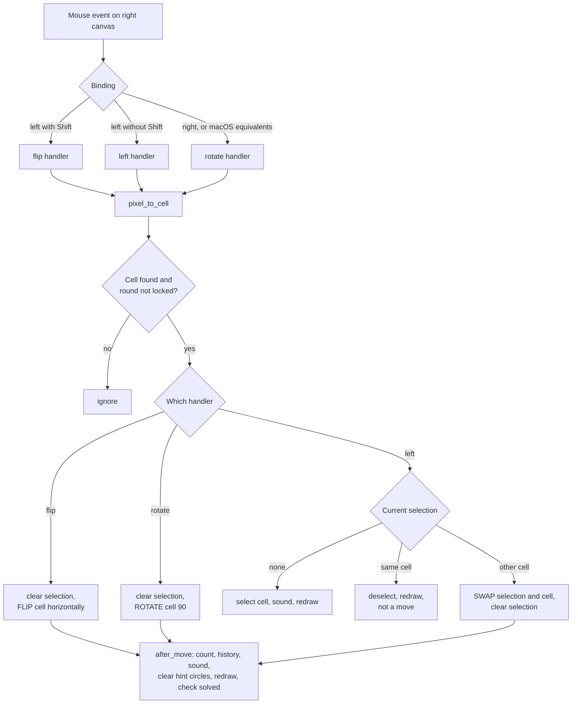
```mermaid
flowchart TD
    E["Mouse event on right canvas"] --> T{"Binding"}
    T -- "left with Shift" --> SH["flip handler"]
    T -- "left without Shift" --> LH["left handler"]
    T -- "right, or macOS equivalents" --> RH["rotate handler"]
    SH --> HC["pixel_to_cell"]
    LH --> HC
    RH --> HC
    HC --> V{"Cell found and<br/>round not locked?"}
    V -- no --> IGN["ignore"]
    V -- yes --> K{"Which handler"}
    K -- flip --> FL["clear selection,<br/>FLIP cell horizontally"]
    K -- rotate --> RO["clear selection,<br/>ROTATE cell 90"]
    K -- left --> SEL{"Current selection"}
    SEL -- none --> S1["select cell, sound, redraw"]
    SEL -- "same cell" --> S2["deselect, redraw,<br/>not a move"]
    SEL -- "other cell" --> S3["SWAP selection and cell,<br/>clear selection"]
    FL --> AM["after_move: count, history, sound,<br/>clear hint circles, redraw, check solved"]
    RO --> AM
    S3 --> AM
```

Render pipeline (after every action):

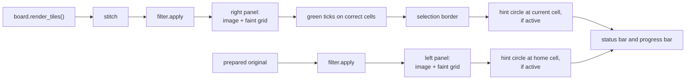
```mermaid
flowchart LR
    A["board.render_tiles()"] --> B["stitch"]
    B --> C["filter.apply"]
    C --> D["right panel:<br/>image + faint grid"]
    D --> T["green ticks on correct cells"]
    T --> SL["selection border"]
    SL --> H["hint circle at current cell,<br/>if active"]
    O["prepared original"] --> C2["filter.apply"]
    C2 --> L["left panel:<br/>image + faint grid"]
    L --> H2["hint circle at home cell,<br/>if active"]
    H --> SB["status bar and progress bar"]
    H2 --> SB
```

Safe load and full reset:

```mermaid
flowchart TD
    A["Load button, Ctrl+O or sample"] --> B{"Path chosen?"}
    B -- no --> Z["nothing happens"]
    B -- yes --> C["build new round in temporary variables:<br/>load, prepare, split, board, scramble"]
    C --> D{"Any error?"}
    D -- yes --> E["message box,<br/>current round keeps running"]
    D -- no --> F["replace board, new GameState,<br/>clear selection, hints, history"]
    F --> G["enable Hint (3), Solve, Undo"]
    G --> H["redraw"]
```

Hint, Solve and completion:

```mermaid
flowchart TD
    HB["Hint pressed"] --> HC{"consume_hint succeeded?"}
    HC -- no --> HX["ignore"]
    HC -- yes --> HP["advisor.pick(snapshots)"]
    HP --> HD["blue circle at current cell on right,<br/>blue circle at home cell on left"]
    HD --> HL{"Hints left = 0?"}
    HL -- yes --> HDIS["disable Hint button"]
    SB["Solve pressed"] --> SS["board.solve, state.reset_after_solve,<br/>history cleared, hints cleared"]
    SS --> CP["complete(auto solved)"]
    WN["last move solved the board"] --> CW["complete(won)"]
    CP --> LK["lock input, disable Hint, Solve, Undo"]
    CW --> LK
    CW --> CEL["victory sound, confetti,<br/>summary dialog"]
```

## 7.3 Rubric rows secured

Side-by-side layout, file dialog, grid control, full reset on new image, accurate click mapping (including near edges), selection highlight, re-render after every action, clicks outside image ignored, counters displayed, both hint circles, completion notification and lock, Solve button, cancelled dialog and error message boxes. OOP: `ImagePanel` → `InteractivePanel` inheritance; controller class interaction.

## 7.4 Required features — detailed specification

### R1. Layout

```
┌───────────────────────────────────────────────────────────────────────┐
│ [Load Image] Grid:[3×3▾] Filter:[Normal▾] Fit:[Crop▾]  [Hint (3)] [Solve] [Undo] │
├──────────────────────────────┬────────────────────────────────────────┤
│   Original (reference)       │   Your puzzle (click to play)          │
│   [ left canvas ]            │   [ right canvas + faint grid ]        │
├──────────────────────────────┴────────────────────────────────────────┤
│ Moves: 12   Incorrect: 5   Time: 01:23   Score: 640   ▓▓▓▓▓░░ 20/25   │
│ Status message line                                                   │
│ Left: select/swap · Right: rotate 90° · Shift+Left: flip              │
└───────────────────────────────────────────────────────────────────────┘
```

- Grid dropdown is read-only (no free typing), default 3×3.
- Hint, Solve and Undo start disabled until an image is loaded.
- A controls legend is always visible, so the player never has to guess.

### R2. Panel hierarchy (inheritance)

- `ImagePanel`: owns a canvas; `show(image, N)` converts OpenCV BGR → RGB → Tk photo image, **keeps a reference** to it (otherwise Tkinter's garbage collection makes the image vanish), draws the image and the faint grid; methods to draw/clear overlays by tag: `grid`, `tick`, `select`, `hint`.
- `ReferencePanel(ImagePanel)`: no event bindings at all (reference only).
- `InteractivePanel(ImagePanel)`: adds mouse bindings and forwards `(cell, action)` to callbacks. It knows nothing about game rules.

### R3. Accurate click mapping (pure function)

Keep this outside Tkinter so it's unit-testable.

```
FUNCTION pixel_to_cell(x, y, image_left, image_top, image_side, N)
    lx <- x - image_left; ly <- y - image_top
    IF lx < 0 OR ly < 0 OR lx >= image_side OR ly >= image_side: RETURN NONE   // off-image → ignored
    tile <- image_side / N
    col <- floor(lx / tile); row <- floor(ly / tile)
    RETURN Cell(min(row, N-1), min(col, N-1))                                   // guards the last pixel
```

Account for the offset if the image is centred inside a larger canvas.

### R4. Event handling (including the Shift trap)

In Tkinter, a Shift + left click can also trigger the plain left-click binding. Bind both, and in the plain handler check the Shift modifier bit on the event and return immediately if it is set. Alternatively use one left-click handler that branches on the modifier.

```
ON left_click(event):
    IF shift held: RETURN handled by flip handler
    cell <- pixel_to_cell(...); IF cell is NONE OR round locked: RETURN
    IF selection is NONE:            selection <- cell; play "select"; redraw
    ELSE IF selection = cell:        selection <- NONE; redraw                  // deselect, not a move
    ELSE: apply SWAP(selection, cell); selection <- NONE; after_move(SWAP record)

ON right_click(event):
    cell <- ...; IF NONE or locked: RETURN
    selection <- NONE; apply ROTATE(cell, 90); after_move(record)

ON shift_left_click(event):
    cell <- ...; IF NONE or locked: RETURN
    selection <- NONE; apply FLIP(cell, HORIZONTAL); after_move(record)

FUNCTION after_move(record)
    state.register_move(); history.push(record); play matching sound
    clear hint circles on BOTH panels                  // "disappears after the next move"
    redraw()
    IF board.is_solved(): complete(auto_solved = false)
```

On macOS, right click may arrive as Button-2 or Ctrl+click; bind those too.

### R5. Rendering pipeline (runs after every action)

```
FUNCTION redraw()
    right_image <- stitch(board.render_tiles(), N)
    left_image  <- prepared original
    f <- selected filter
    left_panel.show(f.apply(left_image), N)
    right_panel.show(f.apply(right_image), N)            // image + faint grid
    FOR EACH snapshot IN board.snapshots(): IF snapshot.is_correct: draw green tick at snapshot.current (top-right corner)
    IF selection: draw coloured border inside selected cell
    re-draw active hint circles (if a hint is currently showing)
    update Moves, Incorrect, Score, progress bar
```

Overlay drawing order: image → grid → ticks → selection → hint. Grid lines: thin, semi-neutral colour so they're "faint" but visible on light and dark photos.

### R6. Hint, Solve, completion

```
ON hint_pressed:
    IF NOT state.consume_hint(): RETURN
    s <- hint_advisor.pick(board.snapshots()); IF s is NONE: RETURN
    clear hint circles; blue circle at s.current on right panel; blue circle at s.home on left panel
    update button text "Hint (n)"; IF state.hints_left = 0: disable Hint button

ON solve_pressed:
    board.solve(); state.reset_after_solve(); history.clear(); selection <- NONE
    clear hints; redraw(); complete(auto_solved = true)

FUNCTION complete(auto_solved)
    lock round: disable Hint, Solve, Undo; tile handlers check the lock flag
    IF NOT auto_solved: play victory; show win dialog (moves, time, score, stars, records, achievements)
    ELSE: status "Auto-solved. Load a new image to play again." (no stats recorded)
```

### R7. Loading and full reset

```
ON load_pressed:
    path <- open file dialog filtered to jpg/jpeg/png/bmp (with "All files" option)
    IF path empty: RETURN                                    // cancelled → no change, no error
    TRY:
        img <- image_service.load(path)
        prepared <- image_service.prepare(img, chosen N, chosen fit mode)
        new_board <- PuzzleBoard(image_service.split(prepared, N), N); new_board.scramble()
    CATCH ImageLoadError e: show error message box with e.message; RETURN   // current round untouched
    CATCH any other error: show generic error message box; RETURN
    // only now replace the round — so a failed load never destroys the current game
    board <- new_board; state <- new GameState(N, board.par_moves())
    selection <- NONE; clear hints; history.clear()
    enable Hint (text "Hint (3)"), Solve, Undo; status "Restore the picture!"; redraw()
```

### R8. Global safety net

Override Tkinter's callback-exception reporter so any unexpected error inside a button or click handler shows a message box ("Something went wrong… you can keep playing or load a new image") and is logged, instead of the app silently breaking.

## 7.5 Creative features

- **C1. Polished theme.** Dark neutral background, one accent colour, consistent fonts and spacing from `theme.py`; buttons with clear disabled states.
- **C2. Hover highlight.** A subtle outline follows the mouse over the right panel so players see exactly which tile a click will hit (reinforces accurate mapping near edges). Cleared when the mouse leaves the canvas.
- **C3. Keyboard shortcuts.** `Ctrl+O` load, `H` hint, `Ctrl+Z` undo, `Esc` clear selection. Shortcuts never replace required mouse actions and respect the lock.
- **C4. Live progress.** Progress bar of correct tiles (e.g. 20/25) and a one-second timer refresh loop running for the whole app lifetime.
- **C5. Win celebration.** Short confetti animation drawn on the right canvas using timed callbacks (no blocking loops), then a summary dialog with stars, records and achievements.
- **C6. Sample picker.** A "Try a sample" menu using the built-in sample images, so a demo works without any files.
- **C7. Puzzle code display.** Show the scramble seed in the status bar ("Puzzle #48213") so the same puzzle can be replayed.

## 7.6 Edge cases to handle

- Clicks in the canvas margin, outside the image → ignored.
- Clicks exactly on a grid line or the last pixel column/row → map to a valid cell (guarded in R3).
- Rapid double-clicks → each click processed independently; no crash.
- Changing grid size or fit mode mid-round → takes effect on next load (show a status note).
- Changing filter mid-round → redraw only; counters and correctness unchanged.
- Window closed while a sound is playing → no hang (sounds run on background daemon threads).
- Load failure while a round is active → message box; current round still playable.

## 7.7 Testing plan

**Automated (no display needed):** `pixel_to_cell` — centre of each cell; first and last pixel of each row/column; exactly on grid lines; negative and beyond-edge coordinates → NONE; with canvas offsets; for N = 3, 4, 5.

**Scripted smoke test (virtual display):** boot the window under a virtual X display, load a sample for each grid size, trigger each handler, hint, solve and every filter, assert no exceptions and that counters change as expected.

**Manual acceptance checklist (run at each grid size):**

| # | Action | Expected |
|---|---|---|
| 1 | Cancel the file dialog | Nothing happens; no error. |
| 2 | Choose a `.txt` or corrupt image | Friendly error message box; app keeps working. |
| 3 | Load JPG, PNG, BMP | Loads, side by side, faint grid on right. |
| 4 | Left click tile | Coloured border shown. |
| 5 | Left click same tile | Border removed; moves unchanged. |
| 6 | Left click two different tiles | Swapped; moves +1; border cleared. |
| 7 | Right click | Tile rotates 90° clockwise; moves +1. |
| 8 | Shift + left click | Tile flips horizontally; no selection side effect; moves +1. |
| 9 | Click left image | Nothing happens. |
| 10 | Click outside images | Nothing happens. |
| 11 | Put a tile in place and orientation | Green tick appears; incorrect count −1. |
| 12 | Hint | Blue circles on both images; disappear after next move. |
| 13 | Hint 3 times | Button disabled. |
| 14 | Solve | Picture restored; moves and score 0; input locked. |
| 15 | Solve normally | Win notification; input locked. |
| 16 | Load another image | Everything reset: moves, hints, timer, selection, circles, undo. |

## 7.8 Deliverables checklist

- [ ] Theme constants and layout
- [ ] Pure hit-test + tests
- [ ] ImagePanel / ReferencePanel / InteractivePanel
- [ ] All click handlers incl. Shift handling and macOS right-click
- [ ] Render pipeline with all overlays
- [ ] Hint, Solve, completion lock
- [ ] Load with safe replacement + full reset
- [ ] Global error handler and message boxes
- [ ] C1–C7 creative features
- [ ] Smoke test + manual checklist passed at 3×3, 4×4, 5×5

---

# 8. Rubric Traceability Matrix

| Rubric criterion | Owner | Where specified |
|---|---|---|
| Code quality, style, documentation | All | 3.4 |
| Fully playable at all grid sizes | All (verified by M4 checklist) | 7.7 |
| Encapsulation | M1 Tile, M3 GameState | 4.4 R1, 6.4 R1 |
| Inheritance & polymorphism | M1, M2, M3, M4 | 3.2 table |
| Cancelled dialogs, non-image files, off-image clicks, message boxes | M2 (errors) + M4 (dialogs/clicks) | 5.4 R1, 7.4 R3/R7/R8 |
| JPG/PNG/BMP, aspect-correct resize, crop/pad | M2 | 5.4 |
| Three grid sizes tile correctly | M2 + M1 | 5.7, 4.8 |
| 3+ transformation types, random, scales, no tile twice | M1 | 4.5 A2 |
| Reassembly into single image | M2 stitch + M1 render order | 5.4 R4, 4.4 R4 |
| All overlays (grid, ticks, selection, hints) | M4 | 7.4 R5 |
| Side by side, dialog, grid control, full reset | M4 | 7.4 R1, R7 |
| Accurate select/swap/rotate/flip mapping, re-render, off-image ignored | M4 (+ M1 apply) | 7.4 R3–R5 |
| Moves and tiles-left updated every action | M3 counts + M1 incorrect_count + M4 display | 6.4 R1, 7.4 R5 |
| Hint correct (both images, limit) | M3 budget/pick + M4 drawing | 6.4 R2, 7.4 R6 |
| Completion notified, input locked, Solve | M3 lock/reset + M1 solve + M4 UI | 6.4 R3, 4.4 R4, 7.4 R6 |

---

# 9. Milestones

| Phase | Goal | Exit criteria |
|---|---|---|
| 0. Kickoff | Repo public, all members added, contracts in 3.3 agreed. | `common/` records merged; branches created. |
| 1. Core | Each member's required features (R-items) done in isolation with tests. | All member tests green on their branches. |
| 2. Creative | Each member's C-items done. | Tests for C-items green; docstrings complete. |
| 3. Review | Cross-review PRs against Sections 2.3 guardrails and 3.4 standards. | All PRs approved and merged. |
| 4. Acceptance | Manual checklist (7.7) passed at all three grid sizes. | Checklist signed off; `github_link.txt` filled; zip prepared. |

---

# 10. Glossary

| Term | Meaning |
|---|---|
| Cell | A grid position (row, column). |
| Home | The cell a tile belongs in. |
| Orientation (r, m) | Tile mirrored horizontally if m, then rotated clockwise r × 90°. Correct = (0, false). |
| Scramble | The batch of random transformations applied on load. |
| Par | Minimum number of moves that can solve the current board. |
| Snapshot | Read-only record describing one tile, shared between modules. |
| Round | Everything from loading one image until completion or the next load. |